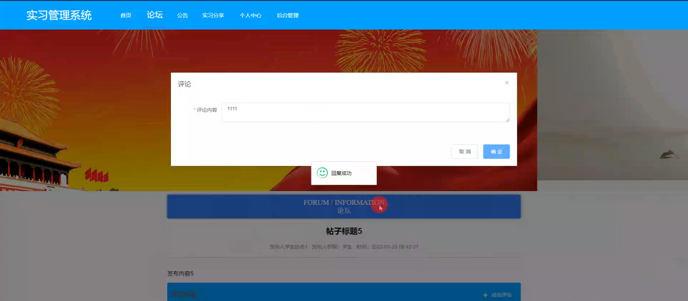
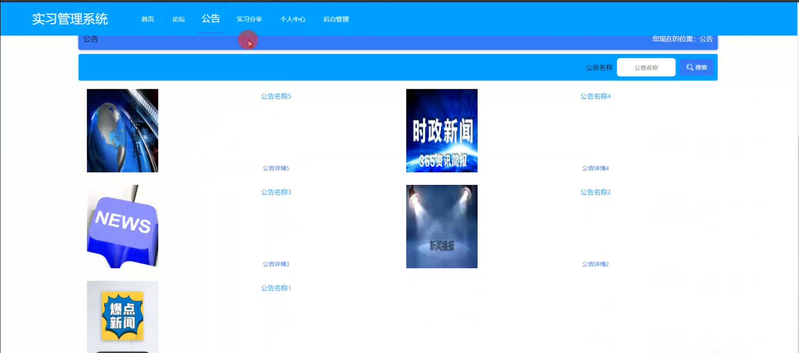
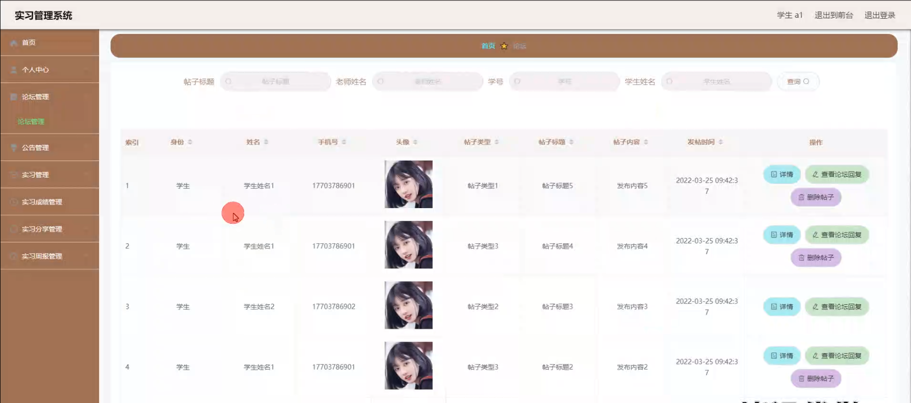
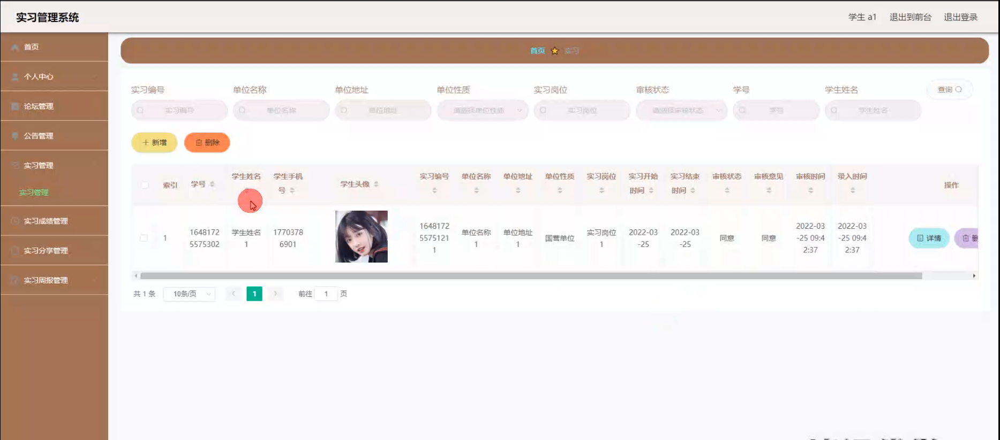
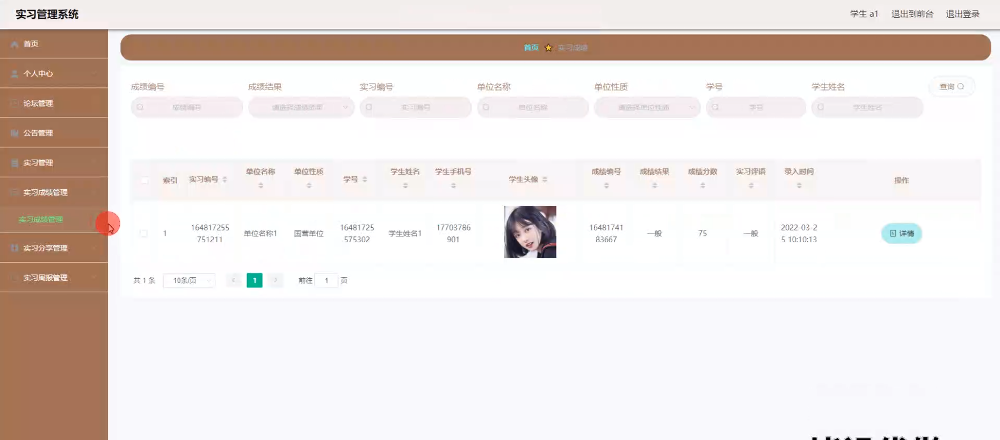
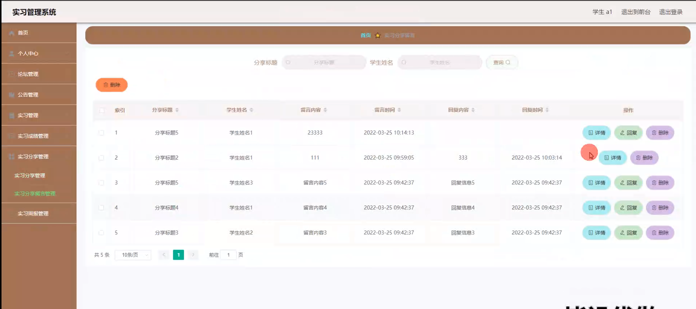
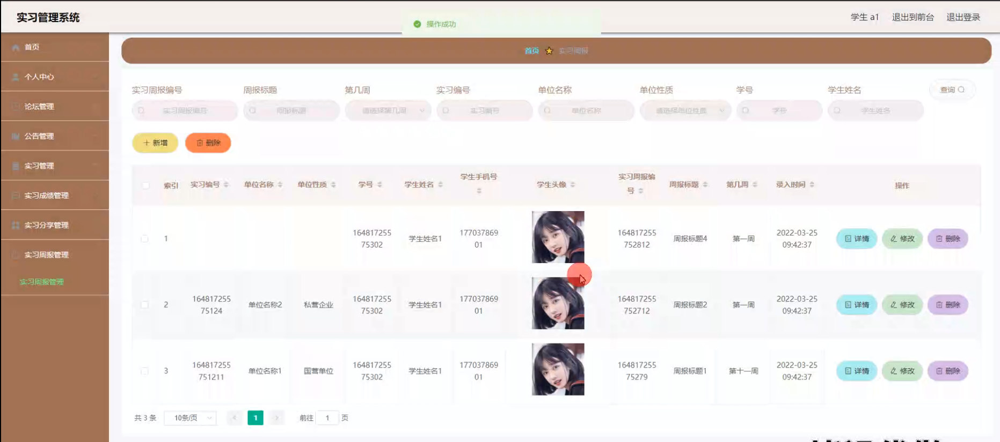
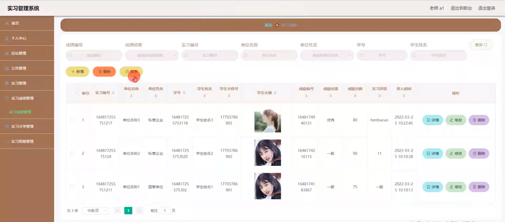
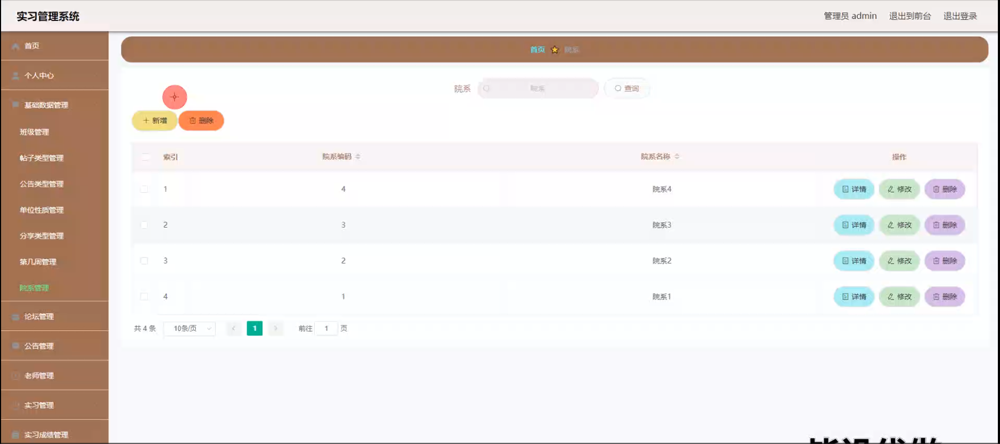
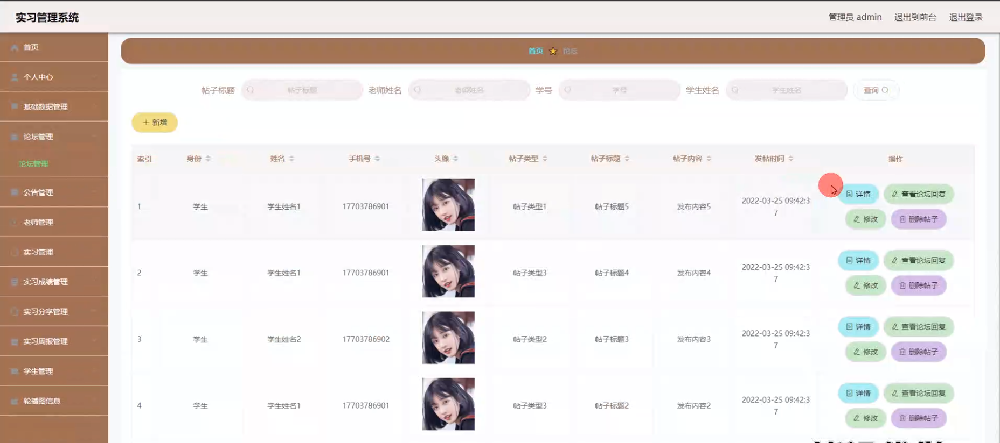

# 毕业设计精选-基于springboot的实习管理系统

---
### 👉作者QQ ：1556708905 微信：zheng0123Long (支持定制修改、部署调试、定制毕设)

### 👉接网站建设、小程序、H5、APP、各种系统等

---

#### 介绍

基于Spring Boot的实习管理系统是一款面向高校、职业培训机构的综合性实习管理平台。系统设计包含三种角色：管理员、教师和学生。通过该系统，管理员可以高效地管理学生的实习过程，教师能够监督和指导学生的实习，学生可以记录和分享自己的实习经历。

#### 研究背景

随着高校教育的不断发展，实习已成为学生获取实际工作经验、提升实践能力的重要途径。然而，传统的实习管理方式存在诸多问题，如信息分散、沟通不畅、缺乏实时监督等。基于此，开发一款集信息管理、沟通交流、成绩评定于一体的实习管理系统显得尤为必要。现有研究大多侧重于某一特定功能的实现，缺乏整体性的综合管理平台。此外，一些系统在用户体验和功能完备性方面也存在一定的局限性。

#### 技术栈

后端技术栈：Springboot+Mysql+Maven

前端技术栈：Vue+Html+Css+Javascript+ElementUI

开发工具：Idea+Vscode+Navicate

#### 系统功能介绍

管理端  
个人中心：管理员可以管理个人信息，修改密码，查看个人操作记录等。  
基础数据管理：管理系统的基本信息和配置，包括学校信息、专业信息等。  
论坛管理：管理员可以创建和管理论坛话题，监督论坛内容。  
公告管理：发布和管理系统公告，确保重要信息及时传达。  
老师管理：管理教师信息，分配和调整教师职责。  
实习管理：跟踪和管理学生的实习信息，包括实习单位、实习内容等。  
实习成绩管理：记录和评定学生的实习成绩，生成成绩单。  
实习分享管理：管理员可以查看和管理学生的实习分享内容。  
实习周报管理：管理和审核学生的实习周报，确保学生按时提交。  
学生管理：管理学生信息，包括新增、删除、修改学生资料。  
轮播图信息管理：管理系统首页的轮播图，展示重要信息和活动。  

教师端  
论坛：教师可以参与论坛讨论，发布和回复帖子。  
公告：查看系统公告，了解最新动态。  
实习分享：浏览和评论学生的实习分享，提供指导和建议。  
个人中心：教师可以管理个人信息，修改密码，查看个人操作记录等。  
后台管理：  
论坛管理：创建和管理论坛话题。  
公告管理：发布和管理公告。  
实习管理：查看和管理分配给自己的实习学生信息。  
实习成绩管理：记录和评定学生的实习成绩。  
实习分享管理：审核和管理学生的实习分享内容。    
实习周报管理：查看和管理学生提交的实习周报。  

学生端  
论坛：学生可以参与论坛讨论，发布和回复帖子。  
公告：查看系统公告，了解最新动态。  
实习分享：发布和分享自己的实习经历，记录实习心得。  
个人中心：学生可以管理个人信息，修改密码，查看个人操作记录等。  
后台管理：  
论坛管理：参与和管理个人相关的论坛话题。  
公告管理：查看和管理与自己相关的公告信息。  
实习管理：记录和管理自己的实习信息。  
实习成绩管理：查看和管理自己的实习成绩。  
实习分享管理：发布和管理自己的实习分享内容。  
实习周报管理：按时提交和管理自己的实习周报。  

#### 系统作用

该实习管理系统在提高实习管理效率、促进师生沟通、提升学生实习体验方面发挥了重要作用。具体包括：  

信息集中管理：通过系统将实习相关信息集中管理，避免信息分散、数据丢失等问题。  
实时沟通交流：通过论坛和在线交流功能，师生可以实时沟通，解决实习过程中遇到的问题。  
有效监督管理：通过实习周报和成绩管理功能，教师可以实时监督学生的实习进展，及时给予指导。  
提高工作效率：通过系统自动化管理，减少了人工操作，提高了管理效率。  
提升实习体验：学生可以通过系统记录和分享实习经历，互相学习和借鉴，提升实习体验。  

#### 系统功能截图

登录界面

评论模块

公告模块

实习分享

学生端论坛管理

实习管理

实习成绩管理

实习分享留言管理

实习周报管理

老师端实习成绩管理

管理员端基础数据管理

论坛管理

#### 总结

基于Spring Boot的实习管理系统是一款功能完善、用户友好的综合性实习管理平台。它不仅解决了传统实习管理方式的诸多弊端，还在信息管理、沟通交流、监督管理等方面提供了全方位的支持。然而，随着技术的发展和需求的变化，系统在功能扩展、用户体验优化等方面仍需不断完善。未来，可以结合人工智能、大数据等技术，进一步提升系统的智能化水平和服务能力。

#### 使用说明

创建数据库，执行数据库脚本 修改jdbc数据库连接参数 下载安装maven依赖jar 启动idea中的springboot项目

前台登录页面
http://localhost:8080/shixiguanlixitong/front/index.html

后台登录页面
http://localhost:8080/shixiguanlixitong/admin/dist/index.html

管理员				账户:admin 		密码：admin

老师				账户:a1 		密码：123456

学生				账户:a1 		密码：123456
